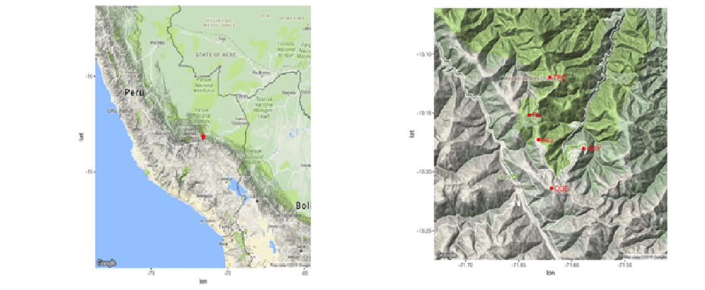
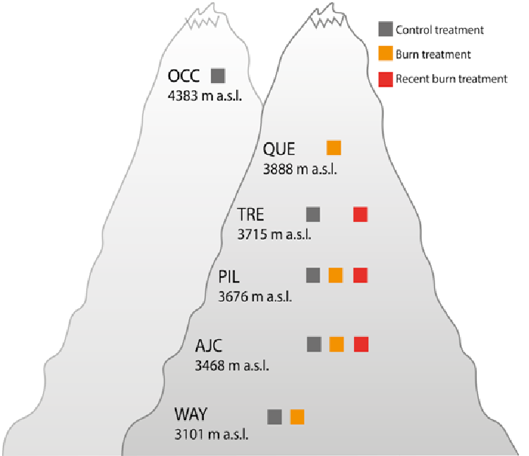

<style>
p.caption {
  font-size: 0.8em;
}
</style>

```{r, include=FALSE}
knitr::opts_chunk$set(
  collapse = TRUE,
  comment = "#>",
  message = FALSE,
  warning = FALSE
)
```

# PFTC3 Wayqecha (PERÚ)

This is an R tutorial for working with the data from the PFTC3 in Wayqecha, Peru. The purpose of the tutorial is to be able to download the data, read them and understand their structure before playing with them.

## STUDY AND SITE INFORMATION

The PFTC3 was held at Wayqecha, Cusco, Peru, following the general outline of the PFTC courses. The PFTC3 used two main study systems; we studied the variability of plant functional traits, ecosystem fluxes and photosynthesis along an elevational gradient and along a gradient in time since fire using locations with different fire histories previously studied by Immaculada Oliveras (Oliveras et al., 2014a).

The PFTC3 consisted of four main student group projects: 

1.    Traits along elevation. This project aimed to assess the role of climate and biotic factors in determining plant community leaf trait composition. 
2.   Traits in experiments. The aim of this group project was to assess the fire history impact over plant community leaf trait composition, and if there was an interaction with elevation.
3.    Leaf Photosynthesis Temperature Response. The aim of this project was to capture how photosynthetic capacity and leaf thermoregulation of graminoid plant species varied with leaf temperature.
4.    CO2 Efflux project. The main objective of this study was to measure how functional trait composition influences ecosystem functioning by measuring CO2-flux within and across plant communities. The project measures CO2 fluxes in high altitude grassland plant communities along the elevation gradient and within fire experiment. We also examine the relationship between elevation and carbon fluxes and ecosystem productivity across the elevation gradient.
Additionally, Plant community composition was recorded on each site. 

Our studies are conducted in six grassland sites in the southeastern Peruvian Andes of Perú, in the buffer zone of the Manu National Park, department of Cusco. These tropical alpine grasslands are located above the upper treeline limit of the cloud forest, often referred to as puna vegetation. 

The majority of the research sites were established in March 2018, and three new sites were established in April 2019. At each site, we sampled sub-sites with different fire history when available, attempting to create a fire chronosequence independent of the elevational gradient. This was restricted by the availability of sites with different fire histories at different elevations.   

```{r echo=FALSE, out.width='60%', fig.cap= "Map over the PFTC3 study area (a) and  sites (b) in Peru"}

```

```{r echo=FALSE, out.width='60%', fig.cap= "Conceptual diagram over the climate along altitudinal gradient, and over experiment treatments. Two more sites were added by the Puna team in April 2019 - a burnt site at Tres Cruces and a control site at Occoruro"}

```

## 1. Install packages

First, is important to install all packages needed. The code in the file "setup.R" will do this and check you have a recent version of R.

## 2. Load the packages
```{r load_packages, eval=TRUE}
library("tidyverse")
library("dataDownloader")
library("DBI")
library("vegan")
library("ggvegan")
library("patchwork")
```

## 3. Download the data

Download the data and store it in the proper files

```{r Download the data, eval=TRUE}
# Instructions to download the Data
# Location of PFTC Data
# The data are located in OSF repository
# To know the exact location of each PFTC Data check this file:
# https://docs.google.com/spreadsheets/d/1y81Xv33BaoWV2FNx0F9XbikjKeHLGNxfmWZ2w4xmISk/edit#gid=0

## COMMUNITY DATA

# Peru community data for the gradient:
get_file(node = "7mzjk", remote_path = "Peru",
         file = "PFTC3.1_CommunityCover_2018_Peru.csv",
         path = "community/data")

## TRAIT DATA
get_file(node = "7mzjk", remote_path = "Peru",
         file = "PFTC3.7_Traits_2018_Peru_cleaned.csv",
         path = "traits/data")

## Carbon flux
get_file(node = "7mzjk", remote_path = "Peru",
         file = "standardControlFluxPE_2016.Rdata",
         path = "Cflux/data")
```

## 4. Read the data

### Community data

The community data are located in Peru/community/data.

```{r Community data, eval=TRUE}
com <- read_csv(file = "community/data/PFTC3.1_CommunityCover_2018_Peru.csv")
```
 
### Trait data

The traits data are located in Peru/traits/data, in a single file.
                                                            To read the csv file:
```{r Trait data, eval=TRUE}
traits <- read_csv(file = "traits/data/PFTC3.7_Traits_2018_Peru_cleaned.csv")
```
                                                         
### Carbon fluxes data

The Carbon fluxes data are located in Peru/Cflux/data, in a single file.
                                                            To read the csv file:
```{r Carbon fluxes data, eval=TRUE}
Cflux <- read_csv(file = "Cflux/data/standardControlFluxPE_2016.Rdata")

head(Cflux)
```
                                                   
